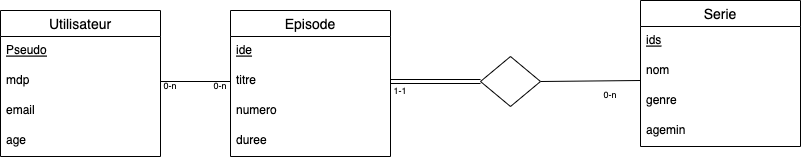
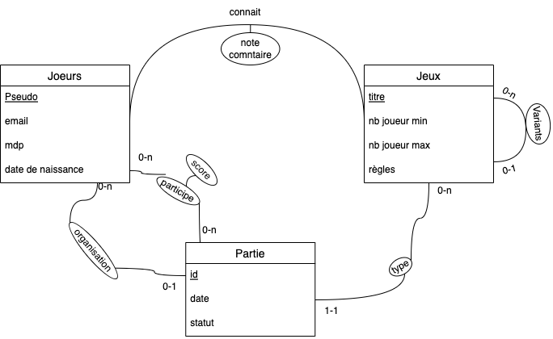

# Réponse examen

**Sommaire :**

- [Réponse examen](#réponse-examen)
  - [Exercice 1](#exercice-1)
  - [Exercice 2](#exercice-2)
  - [Exercice 3](#exercice-3)
  - [Exercice 3Bis](#exercice-3bis)
  - [Exercice 4 Modélisation](#exercice-4-modélisation)

**Schéma :**



## Exercice 1

1. oui
2. oui
3. oui
4. oui
5. oui
6. non -> interdit

## Exercice 2

>1. Check (pseudo <> mdp)
>2. VARCHAR[25] pseudo
>3. NOT NULL
>4. (ids, numero) UNIQUE (dans épisode)
>5. ON DELETE CASCADE

## Exercice 3

>1. SELECT DISTINCT
>2. SELECT DISTINCT .... IS NUL ....
>3. SELECT pseudo FROM utilisateur NATURAL JOIN regarde as J1, (serie NATURAL JOIN episode as J2 WHERE J1.idE = J2.idE AND J2.agemin > J1.age)
>4. SELECT nom, COUNT(*) as nb FROM Serie NATURAL JOIN episode GROUP BY nom ORDER BY ub
>5. SELECT nom, COUNT(*) as nb FROM Serie NATURAL JOIN WHERE genre = 'Serie Film' episode GROUPE BY nom HAVING COUNT(*) >=30
>6. FROM (regarde NATURAL JOIN episode) as J1 WHERE J1.numero <> 1 AND J1 numeros 1 NOT IN (SELECT J2 numero FROM (regarde NATURAL JOIN episode) as J2 WHERE J1 pseudo = J2 pseudo AND J1.ids = J2.ids )
>7.
>
>
```sql
WITH X AS (
    SELECT idE, AVG (note) as nb 
    FROM (regarde NATURAL JOIN episode) as J2, serie S
    WHERE S.idS = J.idS 
    GROUP BY nom, idE, titre, idS
);
SELECT nom, titre
FROM X
WHERE X.nb = (SELECT MAX(Y.NB)
              FROM X as Y
              WHERE X.idS = Y.idS);
```

## Exercice 3Bis

>1. π<sub>titre</sub> = ( σ<sub>Nom = "Rome"</sub>(serie) ⋈ σ<sub>"numero = 1"</sub>(episode))
>2. π<sub>pseudo</sub> (utilisateur) \ π
>   <sub>pseudo</sub>(σ<sub>note = 0</sub>(regarde))
>3. trop dur

## Exercice 4 Modélisation



Joueur(<u>pseudo</u>, email, ...)

Jeux(<u>titre</u>, ...)

Variante(<u>jeu#, variante#</u>)

Commentaires(pseudo, titre, note, commentaire)

Partie(<u>id</u>, date, statut, pseudo_orga#, jeu#)

Participe(<u>joueur#, partie#</u>, classement, score)